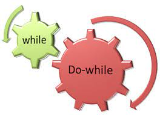

<h1><b>Topics of programation</b></h1>
 

In this repository you can watch some topics about programation with C++. This file will be updated as I learn about it.
  

 
 <a href="https://github.com/UP210263/UP210263_CPP/tree/main/U1">Unidad 1</a> 
Unit 1 is about the basics of C++ programming.
Concepts such as the types of variables such as displaying a message on the screen or making it possible for the user to enter data into the program.
To be able to program in c++ I use the "Visual studio code" development environment because it is fast and above all because it is very easy to use.

   

  

<a href="https://github.com/UP210263/UP210263_CPP/tree/main/U2">Unidad 2</a> 
  Unit 2 can find any programs that use some control structures like: 
       The if is a linear control structure to generate different paths to take in each possible situation.    
   The While and Do while are very similar repetitive control structures that are used to execute the same process as many times as necessary, changing only a little the values involved.The only difference between them is that in the Do while the process is repeated at least once and in the While if its condition is not met, the process will not be executed even the first time.

    
     The for loop is similar to the while loop with the marked difference that in the for loop it is necessary to know how many times the process inside the for loop is going to be executed.

  

  Author:Martínes Osiris, student at the Polytechnic University of Aguascalientes

