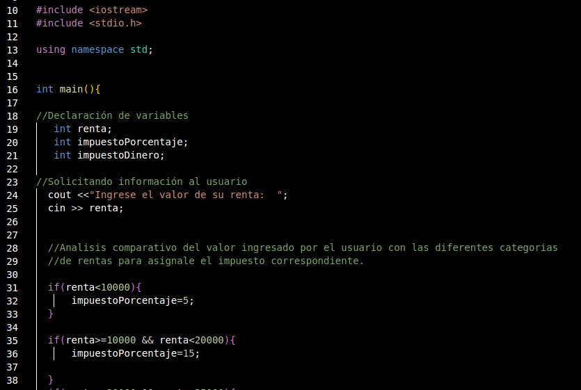
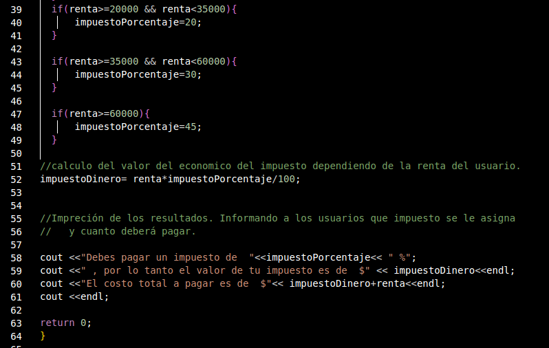
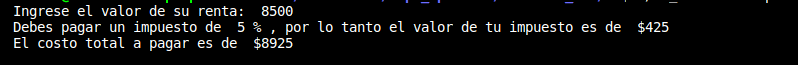
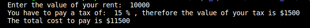
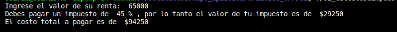
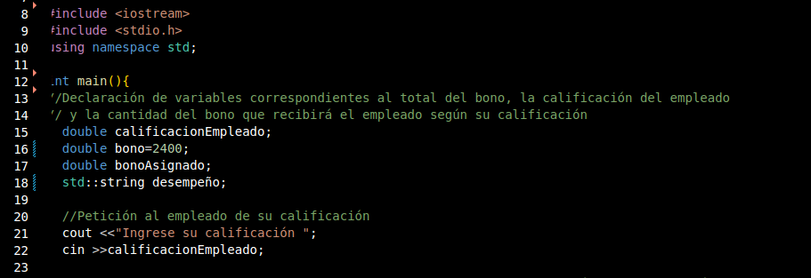

<h1>Unidad II</h1>

En esta unidad se aplica el uso de algunas estructuras de control
 
<H3>Actividad 01:</h3> 
<b>Cálculo de impuestos:</b>Se aplico la estructura de control IF en su forma más simple, con doble condición.

EL proposito de este pequeño programa es calcular e informar del impuesto que le corresponde a cada usuario dependiendo de su renta anual

Como se puede observar en el código, se requirieron cinco if, uno por cada categoria en impuestos. Las categorias asignan impuestos según los siguientes estandares: 
  De 5% a los usuarios con rentas menores a $10,000;un impuesto de 15% a usuarios con rentas entre $10,000 y $19,999; un impuesto de 20% a los usuarios cuyas rentas rondan los $20,000 a los $34,999; un impuesto de 30% a usuarios cuyas rentas se encuantran entre los $35,000 y $59,999; y finalmente un impuesto de 60,000 a lus usuarios que debenpagar anualmente $60,000 o más se les asigna un impuesto del 45%. 
Estos if nos sirven para asignarle el porcentaje debido a la renta del usuario y, en realidad, la linea de código que le asigan valor a la variable correspondiente al presupuesto es lo único que se encuentra dentro de los if.
Fuera de los if se en cuentran, antes de ellos, la declaracion de las tres variables que se requirieron(una para la renta que ingresará el usuario, una para el impuesto que se asigna el en if y una para asignarle el valor económico del impuesto); y después de los if se encuentra el calculo que asinagrá el valor económico mediante la multiplicación de la renta por el porcentaje que le corresponda. Finalmente se impirmen los resultados del impuesto en porcentaje, en dinero y el total a pagar con el impuesto incluido.

  

Al correr el código el resultado depende de en que categoria encaje el valor de la renta ingresada. A continuación se encuentran las musetras del resultado que impirmiría el programa ingreasando una renta para cada categoria:

<h5>1.-Renta < $10,000</h5>
Asignandole una renta de $8,500 
 
  
  <h5>2.-Renta < $20,000 pero = ó < $10,000</h5>
    Asignandole una renta de $10,000 
 
    
  <h5>3.-Renta <  $35,000, pero > ó = $20,000</h5>
      Asignando una renta de $20,000 
         
  <h5> 4.-Renta <  $60,000, pero > ó = $35,000</h5>
       Asignandole una renta de $36,200 
   
      
  <h5>5.-Renta > ó = $60,000</h5>
       Asignandole una renta de $65,000 
   

   
<h3>Activity 02: </h3> 
   
<b>Bonus calculation: </b>The next code have to calculate and show additional bonus for the user. The value of this bonus depend exclusively of note about his work. This notes have three categories: Unacceptable=0.0, Accetable=0.4 and Meritorious=0.6 or greater but smaller than 1. Their bonus will be result of their note by $2,400, that is the maximum value. 
Note:Values differents of 0.0,0.4 and 0.6> will be invalid.

   
   
   
   
  The possibles worgs are mentionated anteriormente. If user entre 0.0, the answer will be:  
   
   and when user enter 0.4 the programm will print: 
   
  y en dado caso de que el empleado ingrese el desempeño de 0.6 aparecerá: 
   
  en dado caso que el desempeño sea mayor a 0.6 y este dentro del rango aceptable del uno,deberá aparecer una impreción como la siguiente: 
   
 Esos son los resultados correspondientes a los desempeños aceptados , pero en caso de ingresar un numero no aceptado se mandará lo siguiente: 
  
   
 <h3>Activity 03 </h3>
 
<b>Choose a pizza: </b>This program is a great option for buy a pizza online. 
  
  
  
  
  
  
  

    
    
  
