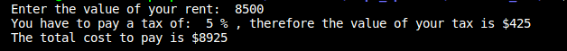

<h1>Unity II</h1>
<p>In this unit the use of some control structures is applied.</p><br>
<H3>Activity 01:</h3> 
<center> 
<b>Calculating taxes:</b>The IF control structure was applied in its simplest form, with a double condition.
<p>The purpose of this small program is to calculate and report the tax that corresponds to each user depending on their annual income</p>

```c++
int main(){

  //Declaration of variables
   int renta;
   int impuestoPorcentaje;
   int impuestoDinero;

  //Request information about user
  cout <<"Enter the value of your rent:  ";
  cin >> renta;
  

  //Comparative analysis of the value entered by the user with the different categories
  //of income to assign the corresponding tax.
```
<P> In this first part, variables are declared and the user is asked to enter the cost of their rental</P>

```c++
  if(renta<10000){
      impuestoPorcentaje=5;
  }

  if(renta>=10000 && renta<20000){
      impuestoPorcentaje=15;
       
  }
  if(renta>=20000 && renta<35000){
      impuestoPorcentaje=20;
  }

  if(renta>=35000 && renta<60000){
      impuestoPorcentaje=30;
  }

  if(renta>=60000){
      impuestoPorcentaje=45;
  }

  //calculation of the economic value of the tax depending on the user's income.
  impuestoDinero= renta*impuestoPorcentaje/100;
```
<p>Each if does a different process for each of the income categories to assign the value corresponding to the percentage of the tax</P>

```c++
  cout <<"You have to pay a tax of:  "<<impuestoPorcentaje<< " %";
  cout <<" , therefore the value of your tax is $" << impuestoDinero<<endl;
  cout <<"The total cost to pay is $"<< impuestoDinero+renta<<endl;
  cout <<endl;

return 0;
}
```
<P> Finally, the results of the calculated tax are shown. </p>

<P>As can be seen in the code, five ifs were required, one for each tax category. The categories assign taxes according to the following standards:<br>
  From 5% to users with incomes less than $10,000; a 15% tax to users with incomes between $10,000 and $19,999; a 20% tax on users whose income is between $20,000 and $34,999; a 30% tax on users whose income is between $35,000 and $59,999; and finally a tax of 60,000 users who must pay annually $60,000 or more are assigned a tax of 45%.<br>
These ifs serve us to assign the percentage due to the user's income and, in reality, the line of code that assigns a value to the variable corresponding to the budget is the only thing found within the ifs.
Outside of the ifs, before them, there is the declaration of the three variables that were required (one for the income that the user will enter, one for the tax that is assigned in the if, and one to assign the economic value of the tax ); and after the if is the calculation that assigns the economic value by multiplying the income by the corresponding percentage. Finally, the results of the tax are printed in percentage, in money and the total to be paid with the tax included.</P>
<br><br>
<p>When running the code, the result depends on which category the entered income value fits into. Below are the samples of the result that the program would print by entering an income for each category:</p>

<h5>1.-Rent < $10,000</h5>
Assigning a rent of $8,500<br>
<br>
  
  <h5>2.-Rent < $20,000 pero = or < $10,000</h5>
    Assigning an income of $10,000<br>
<br>
    
  <h5>3.-Rent <  $35,000, pero > or = $20,000</h5>
      Assigning an income of $20,000<br>
  <br>      
  <h5> 4.-Rent <  $60,000, pero > or = $35,000</h5>
      Assigning an income of $36,200<br>
  <br>
      
  <h5>5.-Rent > or = $60,000</h5>
       Assigning an income of $65,000<br>
  <br>

<br><br><br>
<h3>Activity 02: </h3><BR>
   <p><b>Bonus calculation: </b>The next code have to calculate and show additional bonus for the user. The value of this bonus depend exclusively of note about his work. This notes have three categories: Unacceptable=0.0, Accetable=0.4 and Meritorious=0.6 or greater but smaller than 1. Their bonus will be result of their note by $2,400, that is the maximum value. 
Note:Values differents of 0.0,0.4 and 0.6> will be invalid.<p>
 <br><br>

 
<p>This is the declaration of variables corresponding to the total of the bonus, the qualification of the employee and the amount of the bonus that the employee will receive based on his qualification and and the user is asked to enter his qualification<p>

```c++
 int main(){

  double calificacionEmpleado;
  double bono=2400;
  double bonoAsignado;
  std::string desempeño;

  //Ask employees for their rating.
  cout <<"Write your rating:  ";
  cin >>calificacionEmpleado;
```
<p> The conditional is responsible for indicating whether or not the bonus will be given, and how much the bonus will be according to your user rating.</p>

```c++
  if (calificacionEmpleado==0.4 || calificacionEmpleado>=0.6 && calificacionEmpleado<=1|| calificacionEmpleado==0.0 ){
       bonoAsignado=bono*calificacionEmpleado;//calculation of percentage in bonus money that is assigned to the employee
       if (calificacionEmpleado==0.4){
           desempeño=" Acceptable ";
       }else{
        if(calificacionEmpleado>=0.6){
          desempeño=" Meritorious ";
        }else{
          desempeño=" Unacceptable ";
        }
       }
```
<p>Finally, the amount of the bonus to receive if one is assigned is shown.</p>

```c++
       cout <<"His preformance is "<<desempeño<<"You are entitled to a bonus of: $"<<bonoAsignado<<endl;
       cout <<" "<<endl;
       //Printing of the bonus assigned to inform the employee
  }
```
<p>If the user write any invalid number the code print this message</p>

```c++
  //Assigning a response to any possible invalid value entered by the employee
  else{
    cout <<"The grade entered is not valid."<<endl;
    cout <<" "<<endl;
  }
  return 0;
}

 ```
  <br>
 The possible errors mentioned above. If the user enters 0.0, the response will be: <br>
  <br>
   and when user enter 0.4 the programm will print:<br>
  <br>
  and in the event that the employee enters the performance of 0.6, it will appear:<br>
  <br>
  In the event that the performance is greater than 0.6 and is within the acceptable range of one, a printout like the following should appear:<br>
  <br>
 These are the results corresponding to the accepted performances, but in case of entering a non-accepted number, the following will be sent:<br>
  
 <br><br>
 <h3>Activity 03 </h3>
 <p><b>Cost of your ticket: </b>A company will use this program to automate the payment process to their gaming room. For this reason, the program has the ability to calculate the price that the visitor must pay to enter depending on their age.</p>

 ```c++
int main(){

//variables that the program need to run
int age;
int cost;

//Here the user have to read the personal old
cout << "Enter you old: " ;
cin >>age;
```
<p>After declaring the variables to be used and asking the visitor to enter their age, the program processes this data through an IF cycle that will generate different paths for the different ages that may occur.</p>

```c++
  //Here the if compare the age variable with  the diferents age categories for give value to cost variable
    if (age<0){
      cout << "The number entered is invalue, try one more time please."<< endl;
    }else{
      if (age<4){
        cout << "Your enter is free!!"<<endl;
        cost=0;

      }else if (age>18){
        cost=10;
      }else 
    {
       cost=5; 
    }
```
<p>After detecting to which category the age belongs, a certain value is assigned to the 'cost' variable, which is in charge of presenting the cost to the visitor.</p>

```c++
    cout <<"The cost of your enter is: $" << cost<<endl;//Print the correspondent cost to user
    }
  return 0;
  }

```  
<p>The categories are: </p><br>
<p>1.-Children under 4 years old-enter free: </p>


<p>2.- Persons over 18 years old-pay $10: </p>


<p>3.-Y People under 18 but over 4 pay $5: </p>


<p>If an unacceptable value is entered, this message will be displayed: </p>


 <h3>Activity 04 </h3>
 <p><b>Choose a pizza: </b>This program is a great option for buy a pizza online.Its purpose is to let the user place his order by showing him a menu with the different options available. The program lets the user choose the ingredients and whether their pizza will be regular or vegetarian.</p>
  
  
  
  ```c++
int main(){
    
    //Declaration of varibles
    int ingredients;
    int choose;

    //Ask the user which pizza they would prefer
     cout <<"Choose the pizza type that you want: "<<endl;
     cout <<"Push : -1- for vegetarian  or -2- for regular "<<endl;
     cin >>choose;

     if (choose ==1|| choose ==2)//follows a specific process path depending on user selection


     {
        if (choose==1){//Process for a vegetarian pizza 
            cout <<"choose vegetarian pizza."<<endl;
            cout <<"Now choose the ingredients you want, the options are: "<<endl;
            cout <<"NOTE: All pizzas have motzarell1a  and tomato."<<endl;//Show the possible ingredients to the user for their choose
            cout <<"1.Pepper "<<endl<<"2.Tófu "<<endl;
            cin >>ingredients;
            if (ingredients==1){//display chosen ingredients


                cout <<"Your vegetarian pizza will be of pepper."<<endl;
                
            }else if(ingredients==2) {
                cout <<"Your vegetarian pizza will be of tófu."<<endl;

            }else{
                cout <<"This caracter is invalid."<<endl;
            }
            

        }else{//If the user didn´t choose a number 1.The process take this way
            cout << "Choose regular pizza."<<endl;
            cout <<"Now choose the ingredients you want, the options are: "<<endl;
            cout <<"NOTE: All pizzas have motzarella  and tomato."<<endl;//Show the possible ingredients to the user choose
            cout <<"1.Pepperoni. "<<endl<<"2.Ham. "<<"3.Salmon. "<<endl;
            cin >>ingredients;
            if (ingredients==1){//Display the ingredients selected
                cout << "Your regular pizza will be of pepperoni."<<endl;
                
            }else if(ingredients==2) {
                cout <<"Your regular pizza will be of ham."<<endl;

            }else if (ingredients==3){
                cout <<"Your regular pizza will be of salmon."<<endl;

            }else{
                cout <<"This caracter is invalid."<<endl;
            }
            
            
        }
     }else{//If the user write any caracter not valid the program take this option
        cout << "This caracter is invalid. Try one more time please. ";

     }
     
    return 0;
}int main(){
    
    //Declaration of varibles
    int ingredients;
    int choose;

    //Ask the user which pizza they would prefer
     cout <<"Choose the pizza type that you want: "<<endl;
     cout <<"Push : -1- for vegetarian  or -2- for regular "<<endl;
     cin >>choose;
```
<p>The first thing is to declare the variables and show the user the main menu and limits him to choose one of the two available options</p>
<div aling='center'> </div>
<br>

```c++

     if (choose ==1|| choose ==2)//follows a specific process path depending on user selection


     {
        if (choose==1){//Process for a vegetarian pizza 
            cout <<"choose vegetarian pizza."<<endl;
            cout <<"Now choose the ingredients you want, the options are: "<<endl;
            cout <<"NOTE: All pizzas have motzarell1a  and tomato."<<endl;//Show the possible ingredients to the user for their choose
            cout <<"1.Pepper "<<endl<<"2.Tófu "<<endl;
            cin >>ingredients;
            if (ingredients==1){//display chosen ingredients

```
<p>If the customer chooses option 1, this path is carried out and shows the available ingredients for the vegan pizzas</p><br>
<br>

```c++
                cout <<"Your vegetarian pizza will be of pepper."<<endl;
                
            }else if(ingredients==2) {
                cout <<"Your vegetarian pizza will be of tófu."<<endl;

            }else{
                cout <<"This caracter is invalid."<<endl;
            }
```
<p>After the user chooses an ingredient, it is confirmed by printing a message like the following: </p>
<br>
<p>If a value not presented is entered, the following message will be displayed: </p>
<div aling='center'> <br> </div>

```c++
        }else{//If the user didn´t choose a number 1.The process take this way
            cout << "Choose regular pizza."<<endl;
            cout <<"Now choose the ingredients you want, the options are: "<<endl;
            cout <<"NOTE: All pizzas have motzarella  and tomato."<<endl;//Show the possible ingredients to the user choose
            cout <<"1.Pepperoni. "<<endl<<"2.Ham. "<<"3.Salmon. "<<endl;
            cin >>ingredients;
```
<p>In the same way, if the user selects option 2, the ingredients for the regular pizza will be shown:</p><br>
<br>


```c++
            if (ingredients==1){//Display the ingredients selected
                cout << "Your regular pizza will be of pepperoni."<<endl;
                
            }else if(ingredients==2) {
                cout <<"Your regular pizza will be of ham."<<endl;

            }else if (ingredients==3){
                cout <<"Your regular pizza will be of salmon."<<endl;

            }else{
                cout <<"This caracter is invalid."<<endl;
            }
```
<p>and the ingredient you chose is also printed to the user, in a message like the following:</p>
<br>
<p>and you are shown an error message if you type an unaccepted number: </p><br>

            
```c++        }
        }else{//If the user write any caracter not valid the program take this option
            cout << "This caracter is invalid. Try one more time please. ";

         }
     
        return 0;
      }
  ```
  <p>This last part is responsible for communicating to the client that they entered a number not presented in the main menu</p><br>
  

  <h3>Activity 05 </h3>
  
  <p><b>Average temperature:</b>This program is ready for the user to enter 6 temperatures and determine the average of these, in order to present the user with said temperature, the lowest and the highest.</p>

  ```c++
  int main(){

//Declaration of variables
    int contador=1;
    float temperatura;
    float tempAcum=0;
    int numMayor, numMenor;
 ```   
<p>This program uses a Do-While cycle to request the temperatures repeatedly until reaching 6 temperatures, and within the cycle these 6 temperatures and filters them to obtain the maximum value, the minimum value in addition to calculating the average</p>

```c++
//Begin to the cycle for get the six temperatures 

    do{
        
        cout <<"Give me the temperature: "; //sum the values ​​in a cumulative variable
        cin >>temperatura;
        tempAcum += temperatura;


//save the first temperature in a variable to compare it with the following temperatures
        if(temperatura>numMayor){
            numMayor=temperatura;
        }   
        if(temperatura<numMenor){
            numMenor=temperatura;
        }   
         

        contador++;
    }while (contador<=6);
```
<p>After the loop finishes the process mentioned above the results are printed for the user to see.</p>

```c++
    cout <<"The average of temperature taday is: "<<tempAcum/6<<endl;//Say to user the average and 
     cout << "The bigger number is: "<<numMayor<<endl;//Say to user the bigger value
     cout <<"The minior number is: "<<numMenor<<endl;  //Say to user the minior value

     
    return 0;
    
}
  
 ```
 <p>The result would look like this on the screen: </p>
 <br>

 <h3>Activity 06</h3>

<p><b>Receipt of purchases: </b>This code calcualte the total cost to some products same</p><br>

```c++
int main(){

//Declaration of variables
    float precio;
    int cantidad;
    float total;
```
<p>Using a Do-While cycle to repeat the process as many times as the user wants. This program asks the user to enter the cost of a product and indicate the number of times that item was purchased.</p>

```c++
    do{ //Start the process cycle on the registration of purchases made
        cout <<"write the number of purchased products of the same product: "<<endl;
        cout <<"NOTE:write 0 only if you want close the program."<<endl;
        cin >>cantidad;
        if(cantidad!= 0){//Discard the 0 of the numbers that will have this process
            cout <<"Now, write the price of this product: $"<<endl;//The process is to ask the price of products
            cin >>precio;
            total +=precio*cantidad;//Calculate the total price 
            cout <<"Your total is: $"<<total<<endl; //Show to the user the total price 
        }else
            cout << "Finished prcess"<<endl;//Tell the user that the program has finished
    }while (cantidad != 0);
 return 0;
 }
```
<p>This time the response is printed inside the Do-While cycle.On screen  would look like this: </p>
<br>
<p>Tras el usuario ingrsar el costo del producto y la cantidad, se le debe debolver lo mismo que al inicio, algo así: </p>
<br>
<p>When the user enters "0" to terminate the process, the following should be printed: </p>
<br><br>

<h3>Activity 07</h3>

<p><b>Conversion:</b>This code has the utility of transforming the numbers in the decimal system entered by the user to numbers in the binary system. </p><br>


```c++
    int main(){
       int numero; 
    
    do{

            cout <<"Give me a number: ";
            cin >>numero;
```
<p>Within the Do-While loop, more loops are used to perform the necessary calculation to get the number already converted to binary.</p>

```c++
            if (numero== 0){
                    resultadoFinal="    0";
            }else if(numero<0){
                    cout <<"Character invalid. Try again."<<endl;
            }else
```
<p>Este primer If sive para brindar un resultado rapido si el usuario ingresa un "0"</p>

```c++
            if (numero > 0){
                while (numero!=0){ 
                    resultadoFinal=(numero%2==0)?"0"+ resultadoFinal:"1"+ resultadoFinal;
                    numero /=2;
                
                 }
                 if (numero== 0){
                    cout <<endl;
                }
```
<p>This second IF is used to generate the binary number in case the entered number is different from 0. The required operation is the modulus, since from this the remainder of the division of the entered number by 2 is obtained and repeating this process substituting the value entered by the result of the division</p>

```c++
            }

        }while (numero<0);

            cout <<"In binary is: "<<resultadoFinal<<endl;
            cout <<endl;

    return 0;
    }
```
<p>Finally, the result obtained is printed in the accumulator variable at the end of the process. This result would be displayed as follows:</p>
<br><br>

<h3>Activity 08</h3>

<p><b>Multiplication Tables:</b>Although it might sound simple, this program is not complex because of the calculations it needs but because of its ordered structure within a table that divides the values ​​into categories. </p>

```c++
  int main(){
  //Declaration of variables
      int constante;
      int limite;
      int resultado;

      //Ask the number for the table to user
      cout << "Write a number: ";
      cin >>constante;//Read the number and it give this value to the variable "numero"
      cout <<"Indicate the limit number: ";
      cin >>limite;//Read the number and it give this value to the variable "limite"
```
<p>The first thing that will be done is to collect data from the user in order to generate the table. Assuming the user will enter an 808 and a limit of 12, the first screen will look something like this: </p>


```c++   
      for (int contador= 1; contador <= limite; contador++){//starts the loop to repeat the  multiplication and printing process
      // until the amount of assigned to the "limit" variable is reached

          for (int line= 0; line < 48; line++){//This FOR is for make the frame of the multiplication table.
          
            cout <<"_";
          }
```
<p>This first FOR cycle indicates that the process will be repeated until the counter reaches the limit set by the user. The second is in charge of printing the horizontal lines that will separate the numbers within the table.</p>

```c++
          cout <<endl;
          resultado= constante*contador;// calculate the answer of multiplication
        
          cout <<"|\t"<<contador <<"\t|  X  |\t"<<constante<<"\t|  =  |\t"<<resultado<<"\t|"<<endl;//Print the table and answers for user will can see it
   
      }
```
 <p>Even within the first FOR, the result of the multiplication of the number entered by the user by the counter is calculated (this, due to the cycle, will increase its value at each turn it makes. After obtaining the result, the instruction to print the operation with the specific arrangement of a multiplication table. That is, including the frames that surround and order them, the symbols of equals and multiplication and of course the numbers to be multiplied with their respective result</p>

```c++

      for (int line= 0; line < 48; line++){//make the last line of table    
            cout <<"_";
          }
      cout <<endl;
    
    return 0;
  }

```
<p>This last part is responsible for printing the final line that will close the bottom of the table, finally displaying a result like the following: </p>
 <div algn='center'> </div>


    
    
  
