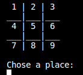
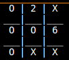
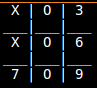
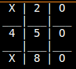
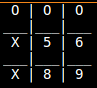
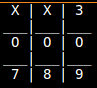
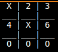
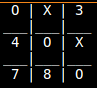
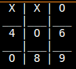

<h1>Unity III</h1>
<H2>Construcción de un tablero de Gato funcional </H2><br>
<div align="center"> 

</div>

<h3>Index:</h3>
<b><p>1.-¿Funciones?<br>
      2.-¿Cómo esta compuesto el código?<br>
      3.-¿Cómo funciona el código?<br>
      4.-¿Cómo usarlo?<br>
      5.-Flujo del proceso<br>
      6.-Ejemplos de funicionamiento<br>
      7.-Conclusión</p></b><br>


<p>En el transcurso de esta unidad desarrollamos poco a poco el código necesario para generar un juedo del Gato funcional.<br>
A continuación se presentara la explicación detalladas sobre cómo funciona, y en que orden se ejecutan cada una de las partes de este código.</p><br><br>


<h3>1.-¿Funciones?</h3>

<p> Puesto que el tema principal de esta unidad fueron las FUNCIONES, estas estan muy presentes dentro de la estructura del código del juego.<br>
Antes que nada es necesario dejar en claro que es una función para no dejar cabos sueltos;pues bien, las FUNCIONES son como cajones de código en el que se guarda comandos especificos para la ejecución de un proceso determinado. Dicho cajón posee un nombre único que es utilizado por el programador para invocar el procedimiento que posee dentro de si, y que se puede repetir cuantas veces sean necesarias con solo escribir su nombre. </p><br><br>


<h3>2.-¿Cómo esta compuesto el código?</h3>

<p>Ahora que está claro el término FUNCIÓN, es tiempo de comentar que este programa requiere de 16 funciones para lograr que el juego funcione como se mostrará más adelante.<br> 
Si bien el código es algo extenso para la naturaleaza del producto final, lo cierto, es que el elemento culpable de la extención del código es la semi inteligencia de la que dotamos al PC para que al jugar contra los usuarios representara un verdadero reto el juego. Gracias a esta inteligencia fue necesario replicar varias de las funciones ya existentes y hacerles pequeñas modificaciones para que cumplieran la labor de realizar simulaciones de posibles jugadas para la PC y de esta forma no solo sacar números de forma aleatoria.<br>
Las funciones que se utilizaron fueron: </p><br>

```c++
        void ttablero(int);                          
        int seleccionarJugada();
        void copiarTablero();
        void reescribirCasilla(int);
        bool comprobarCasillaOcupada(int);
        bool comprobarCasillaImagOcupada(int);
        bool identificarGanador(int);
        bool identificarGanadorImag(int);
        int obtenerJugada();
        void reescribirCasillaImag(int);
        int buenaJugada(char);
        void jugarGato();
        void colocarJugada();
        int inteligencia();
        int jugarPC();
        void jugar2palyers();
        int numJugadores;
```
<P>De la misma manera comenzamos a implementar matrices pequeñas. En este juego, las matrices tienen el papel de ser el tablero no visual del juego, por lo que en esta matriz se registran cada una de las jugadas de ambos participantes en el juego. Además existe un segundo tablero que cumple la función de ser el lienzo en el que se realizan las simulaciones que necesita la PC para escoger una jugada. Dichas matrices son:<br></p>

```c++
//Tablero en el que se registra el juego real entre los dos participantes
char espacioJuego[3][3] = {{'1', '2', '3'},
                           {'4', '5', '6'},
                           {'7', '8', '9'}};

//Tablero en el que se realizan las simulaciones para la PC
char copiaEspacio[3][3] = {{'1', '2', '3'},
                           {'4', '5', '6'},
                           {'7', '8', '9'}};   
```

<p>Si bien las matrices son modificadas fuera de la vista de los usuarios, estas siempre estan en constante cambio de valores en sus determinados espacios. El motivo por el cual el usuario puede ver el tablero, a pesar de estar basado en una matriz, es por que en la funcion ttablero damos instrucciones para que a través de ciclos for se imprima la estructura base tan representativa del juego del gato </p>

```c++
// ttablero funtion
      void ttablero(int)
      {
            int fi = 0, co = 0;
            for (int fila = 0; fila < 5; fila++)
            {
                  for (int columna = 0; columna < 9; columna++)
                  {
                        if (fila == 1 || fila == 3)
                        {
                              cout << "_";
                        }
                        else if (columna == 1 || columna == 4 || columna == 7)
                        {
                        cout << espacioJuego[fi][co];
                        co++;
                        }else{
                              cout << " ";
                        }
                        if (columna == 2 || columna == 5)
                        {
                              cout << "|";
                        }
                  }
                  cout << endl;
                  if (fila % 2 == 0)
                  {
                        fi++;
                  }
                  co = 0;
            }
            cout << endl;
      }


```
<p>La estructura creada en esta función se imprimirá, borrará y reimprimirá en repetidas ocaciones.<br>
Dentro de las fincuiónes del código se encuentran los modos de juego, que se utilizan para que el jugador pueda escoger jugar contra la PC o jugar contra otra persona.Estas funciones poseeen un código similar dentro pero con la impirtante diferencia de que el la funció de jugarGato que corresponde a la opción de jugar contra la PC utiliza más el apoyo de otras funciones, pues todos sus procoesos dependen de los pequeños procesos que generan el resto de funciones.Además dentro de la opción jugar solo se requiere de la simulación de movimientos futuros del jugador y la PC para así poder decidir que jugada hará la PC. Dicha simulación requiere por si misma de un conjunto de funciones diferentes para lograr aportar algo de inteligencia a las deciciones de la PC.</p>

```c++
void jugarGato()
{
    int tablero, jugada;
    bool casillaOcupada = true, ganador = false;
    ttablero(tablero);
            
      do
        {
            if (turnoJugador % 2 == 0)
            {
                jugada = seleccionarJugada();
            }
            else
            {
                jugada = jugarPC();
            }

            casillaOcupada = comprobarCasillaOcupada(jugada);
            if (casillaOcupada == true)
            {
                do
                {
                    cout << "Invalid play. Try again\n";
                    break;
                } while (casillaOcupada == true);
            }
            else if (casillaOcupada == false)
            {
                system("clear");
                reescribirCasilla(jugada);
                ttablero(tablero);
                turnoJugador++;
            }
            ganador = identificarGanador(ganador);
        } while (ganador == false && turnoJugador < 9);
        if (turnoJugador < 9)
        {
            if (turnoJugador % 2 == 0)
            {
                cout << "\033[0;31m  You are the LOSER \033[0m"<<endl<<endl;
            }
            else
            {
                cout << "\033[0;32m You are the WINNER \033[0m"<<endl<<endl;
            }
        }
        else
        {
            cout << "\033[0;33m     Tied game  \033[0m"<<endl<<endl;
        }
        
}


```

<P>Como elementos nuevos para este repositorio, además de las matrices y las funciones, se encuentra el:<br>  
sistem("clear"): Se encarga de borrar el contenido de los espacios de la matriz, para de esta forma dejar lugar disponible para posicionar una jugada. Este se utiliza para el o los jugadores y para la PC.<br>
"\033[0;31m  MESSAGE \033[0m" : Es usado para dar color y estilo a un mensaje o impreción especifica.</p><br> <br>

<h3>3.-¿Cómo funciona el código?</h3>

<p>Como ya se mencionó, el programa requiere de 16 funciones diferentas para funcionar de forma correcta, pero,¿cómo es que realmente funciona este programa?, ciertamente sigue el flujo normal de proceso de todo programa que corre un compilador,  este proceso es de arriba hacia abajo, por lo ques es necesario colocar los nombres de las funciones el tipo de funciones que son y que tipo de variables reciben que se usarán dentro del main u otras funciones, antes de que la función a utilizar se presente, esto para dejar en claro al compilador que dicha función sí existe pero que se encuentra más adelante,por lo que este nombramiento de función activa los procesos de las funciones desde un inicio para así tener disponibles todos esos procesos que se encuentran posteriores al main pero que se requieren para ejecutar el proceso dentro del main. Además se tiene la necesidad de llamar a librerias que permitan el ejecutar algunos procesos especificos. </p>

<P>Para que una matriz sea funcional se requieré que se determine el tipo de contenido que se podrá colocar dentro de sus espacios disponibles, y además cuantos de estos espacios tnedrá. la capacidad de la matriz es la que se coloca después del nombre "[3][3]" que en este caso indica que se trata de una matriz de 9 espacios disponibles para almacenar algún valor. EL tipo de variable que será aceptado dentro de la matriz se determina igual que una variable; es decir, antes del nombre de la matriz. </P><br><br>


<h3>4.-¿Cómo usarlo?</h3>

<p>El código esta diseñado para que el juego sea fácil de entender para el o los jugadores. Lo primero que aparecerá será la pregunta:<br>
<div align="center"></div></p>
<p>Dependiendo de la respuesta del jugador a esta pregunta se tomará un camino determinado.<BR>Si el usuario preciona el "1", seleccionando así la opción de jugar contra la PC, el programa tomará el camino de la funciión 'jugarGato' que imprimira el tablero de inmediato y dará siempre al usuario la primera jugada y sirmpre será el jugador del circulo:   </p>
<div align="center"></div>
<br>
<p>Inmediatamente después de que el usuario escoga una pocisión la PC imprimirá la suya(siempre será la 'X'), tras un analisis en la función jugarPC, que dota a la PC de una pequeña inteligencia que le permite dar una partida más interesante:</p>
<div align="center"></div>

<p>De esta forma el partido fluirá de manera regular hasta que el jugador o la PC consiga ganar, lo cual puede suceder al unir tres circulos o equis en cualquiera de las sigientes formas(representando los triunfos con los circulos):</p>
<b><div  align="left">1. 2.   3. 4. </div>
<div  align="left">5. 6.  7.  8.</b></div>

