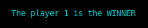

<h1>Unity III</h1>
<H2>Building a Functional Tic Tac Toe Board </H2><br>
<div align="center"> 

</div>

<h3>Index:</h3>
<b><p>1.-Functions?<br>
      2.-How is the code composed?<br>
      3.-How does the code work?<br>
      4.-How to use it?<br>
      5.-Flow of the process<br>
      6.-Examples of operation<br>
      7.-Conclusion</p></b><br>


<p>Over the course of this unit we gradually develop the code needed to generate a functional Tic Tac Toe.<br>
Below is a detailed explanation of how it works, and in what order each part of this code is executed.</p><br><br>


<h3>1.-Functions?</h3>

<p> Since the main topic of this unit was FUNCTIONS, they are very present within the structure of the game code.<br>
First of all, it is necessary to make it clear that it is a function so as not to leave loose ends; well, FUNCTIONS are like code drawers in which specific commands are stored for the execution of a certain process. Said drawer has a unique name that is used by the programmer to invoke the procedure that it has within itself, and that can be repeated as many times as necessary just by writing its name. </p><br><br>


<h3>2.-How is the code composed?</h3>

<p>Now that the term FUNCTION is clear, it's time to comment that this program requires 16 functions to make the game work as it will be shown later.<br>
Although the code is somewhat extensive for the nature of the final product, the truth is that the element to blame for the extension of the code is the semi-intelligence that we endowed the PC with so that when playing against the users the game would represent a real challenge. . Thanks to this intelligence, it was necessary to replicate several of the already existing functions and make small modifications to them so that they would fulfill the task of carrying out simulations of possible plays for the PC and in this way not just draw numbers randomly.<br>
The functions that were used were:</p><br>

```c++
        void ttablero(int);                          
        int seleccionarJugada();
        void copiarTablero();
        void reescribirCasilla(int);
        bool comprobarCasillaOcupada(int);
        bool comprobarCasillaImagOcupada(int);
        bool identificarGanador(int);
        bool identificarGanadorImag(int);
        int obtenerJugada();
        void reescribirCasillaImag(int);
        int buenaJugada(char);
        void jugarGato();
        void colocarJugada();
        int inteligencia();
        int jugarPC();
        void jugar2palyers();
        int numJugadores;
```
<P>In the same way we started to implement small matrices. In this game, the matrices have the role of being the non-visual board of the game, so each of the plays of both participants in the game are recorded in this matrix. In addition, there is a second board that fulfills the function of being the canvas on which the simulations that the PC needs to choose a play are carried out. These matrices are:<br></p>

```c++
//Board on which the actual game between the two participants is recorded
char espacioJuego[3][3] = {{'1', '2', '3'},
                           {'4', '5', '6'},
                           {'7', '8', '9'}};

//Board in which the simulations for the PC are carried out
char copiaEspacio[3][3] = {{'1', '2', '3'},
                           {'4', '5', '6'},
                           {'7', '8', '9'}};   
```

<p>Although the matrices are modified out of the view of the users, they are always in constant change of values ​​in their determined spaces. The reason why the user can see the board, despite being based on a matrix, is because in the ttablero function we give instructions so that the base structure so representative of the Tic Tac Toe is printed through for loops.</p>

```c++
// ttablero funtion
      void ttablero(int)
      {
            int fi = 0, co = 0;
            for (int fila = 0; fila < 5; fila++)
            {
                  for (int columna = 0; columna < 9; columna++)
                  {
                        if (fila == 1 || fila == 3)
                        {
                              cout << "_";
                        }
                        else if (columna == 1 || columna == 4 || columna == 7)
                        {
                        cout << espacioJuego[fi][co];
                        co++;
                        }else{
                              cout << " ";
                        }
                        if (columna == 2 || columna == 5)
                        {
                              cout << "|";
                        }
                  }
                  cout << endl;
                  if (fila % 2 == 0)
                  {
                        fi++;
                  }
                  co = 0;
            }
            cout << endl;
      }


```
<p>The structure created in this function will be printed, deleted and reprinted repeatedly.<br>
Within the code's functions are the game modes, which are used so that the player can choose to play against the PC or play against another person. These functions have a similar code inside but with the important difference that the function was jugarGato, which corresponds to the option to play against the PC, uses the support of other functions more, since all its processes depend on the small processes that generate the rest of the functions. Also, within the play option, only the simulation of future movements is required of the player and the PC in order to be able to decide what play the PC will make. Said simulation itself requires a set of different functions in order to contribute some intelligence to the decisions of the PC.</p><br>

```c++
void jugarGato()
{
    int tablero, jugada;
    bool casillaOcupada = true, ganador = false;
    ttablero(tablero);
            
      do
        {
            if (turnoJugador % 2 == 0)
            {
                jugada = seleccionarJugada();
            }
            else
            {
                jugada = jugarPC();
            }

            casillaOcupada = comprobarCasillaOcupada(jugada);
            if (casillaOcupada == true)
            {
                do
                {
                    cout << "Invalid play. Try again\n";
                    break;
                } while (casillaOcupada == true);
            }
            else if (casillaOcupada == false)
            {
                system("clear");
                reescribirCasilla(jugada);
                ttablero(tablero);
                turnoJugador++;
            }
            ganador = identificarGanador(ganador);
        } while (ganador == false && turnoJugador < 9);
        if (turnoJugador < 9)
        {
            if (turnoJugador % 2 == 0)
            {
                cout << "\033[0;31m  You are the LOSER \033[0m"<<endl<<endl;
            }
            else
            {
                cout << "\033[0;32m You are the WINNER \033[0m"<<endl<<endl;
            }
        }
        else
        {
            cout << "\033[0;33m     Tied game  \033[0m"<<endl<<endl;
        }
        
}


```

<P>As new elements for this repository, in addition to matrices and functions, there is:<br>
system("clear"): It is in charge of deleting the content of the spaces of the matrix, in order to leave space available to position a move. This is used for the player(s) and for the PC.<br>
"\033[0;31m MESSAGE \033[0m" : It is used to give color and style to a specific message or impression.</p><br> <br>


<h3>3.-How does the code work?</h3>

<p>As already mentioned, the program requires 16 different functions to function correctly, but how does this program actually work? It certainly follows the normal process flow of any program running a compiler, this process It is from top to bottom, so it is necessary to place the names of the functions, the type of functions they are and what type of variables they receive that will be used within the main or other functions, before the function to be used is presented, this to make it clear to the compiler that this function does exist but that it is found later, so this function naming activates the function processes from the beginning in order to have available all those processes that are after main but that are require to execute the process inside the main. In addition, there is the need to call libraries that allow the execution of some specific processes. </p>

<P>For a matrix to be functional, it is required to determine the type of content that can be placed within its available spaces, and also how many of these spaces it will have. the capacity of the array is the one that is placed after the name "[3][3]" which in this case indicates that it is an array of 9 spaces available to store some value. The type of variable that will be accepted into the array is determined the same as a variable; that is, before the name of the array.</P><br><br>


<h3>4.-How to use it?</h3>

<p>The code is designed to make the game easy for the player(s) to understand. The first thing that will appear will be the question:<br>
<div align="center"></div></p>
<p>Depending on the player's response to this question, a certain path will be taken.<BR>If the user presses "1", thus selecting the option to play against the PC, the program will take the path of the 'jugarGato' function that will print the board immediately and will always give the user the first move and will always be the player in the circle: </p>
<div align="center"></div>
<br>
<p>Immediately after the user chooses a position, the PC will print his position (it will always be 'X'), after an analysis in the playPC function, which gives the PC a little intelligence that allows it to play a more interesting game:</p>
<div align="center"></div>

<p>In this way, the game will flow regularly until the player or the PC manages to win, which can happen by joining three "O" or "X" in any of the following ways (representing the wins with the circles):</p>

<div  align="center">         
        </div><br><br><br><br><br>

<div align="center"><P>If the player achieves any of these moves, the game will display the following message:</p></div><br>
<div align="center"></div><br>
<div align="center"><p>On the other hand, if the PC is the winner, the program will print:
</p></div><br>

<div align="center"></div><br>
<p>But if the spaces on the board run out and neither of them has made a winning move, the message that will be printed will be:</p><br>
<div align="center"></div><br>
<P>After printing any of the previous messages, the execution of the program will come to an end and this is recognized by seeing in the terminal:</p><br>
<div align="center"></div><br>

<P>When the user chooses the two-player option, the program calls the 'jugar2players' function, which will be in charge of providing the game space to the two users, calling the 'seleccionarJugada' and 'reescribirCasilla' functions twice, which in addition to 'comprobarCasillaOcupada' they take care of most of the processing of this game mode.<br>
As when playing against the PC, the first thing that will be presented will be the board with the spaces that show the number that each one represents, in addition to the message 'choose a place:</p><br>
<div align="center"></div><br>

<p>In the two-player modality, player 1, who corresponds to the symbol 'O', and player 2, who corresponds to the symbol 'X', will always start in the second movement (without the possibility of changing the symbols or turns), if any of the players players achieve one of the winning moves shown previously, the program, depending on which player it is, will display:</p><br>
<div align="center">    </div><br><BR><BR>

<H3>5.-Flow of the process:Flowchart<H3>

                                                             
     
<br><br><br>

<h3>6.-Examples:</h3>


<h3>7.-Conclusion:</h3>

<p>This code was quite difficult for me to structure, in the first instance, because I gave it too long an extension, this is because, to avoid confusion and save analysis time in adapting the functions, I chose to rewrite several functions making them only small changes that in turn generate the same procedure but with different data entry. Secondly, my lack of experience in the development of codes that require a deeper analysis, especially in the arrangement of each of the elements that compose it; This made it difficult for me to clearly visualize how the program would be structured from a general view and later to a more detailed one. In the third instance, I have to admit that I need to put my programming skills into practice, and thus develop my logic, because at certain times I completely lost myself on what I was doing and wasted a lot of time trying to get back to the code. Finally, in the fourth instance, my organization within the code is not very favorable on several occasions, this is due, for the most part, to the fact that I do not organize what I am going to program before typing, so I am blank in front of the screen waiting for ideas to flow out of nowhere and that makes me try various semi-developed ways that are mostly unfinished and that in the end only get in the way of the final code that loses hierarchy organization because I don't have a start order, but rather start several elements at the same time and at the end I see what function was assigned to each function.<br>
The aforementioned points affected my productivity to give efficiency to the program, since it has several defects, the most obvious is the aesthetics, the backend part absorbed so much time that I did not have enough time to dedicate it to the frontend, which is already bad first impression of the program. In addition, the backend is not elaborated with efficiency, since it has limitations; such as the fact that players do not have the possibility to choose their turns or the symbols they are going to play with, or that you can only play one game and then the program closes, these types of details are elements that I could solve but for a bad reason organization of time and logic it was not possible for me to add them to the program. <BR>
The program has the flaw that when using the two-player mode and reaching a draw, the game does not end and it keeps asking you for numbers even when there is no space left to place them, so the game becomes infinite, only terminating the program forcing it through ctrl+C.<br>
But despite all the defects that the program has, it fulfills its function of allowing a tic tac toe to be executed in the terminal and that when playing against the PC, it has the ability to detect which box to choose to avoid let the opponent win. I have also learned a lot from this first slightly more "complex" code, either about the functions, the use that can be given to a matrix and above all the ability to produce a little intelligence for decisions within the game by the PC<br>
I think that the most important thing is to learn from mistakes in order to know how to correct or avoid them in the future, which is why I think that this experience has been stressful, vastly enriching for my growth in the professional field.</p>


